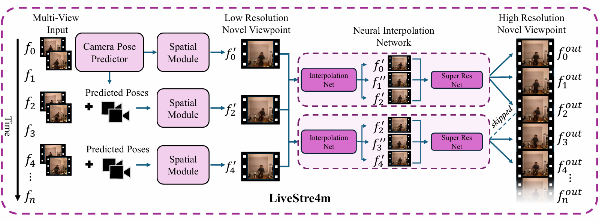
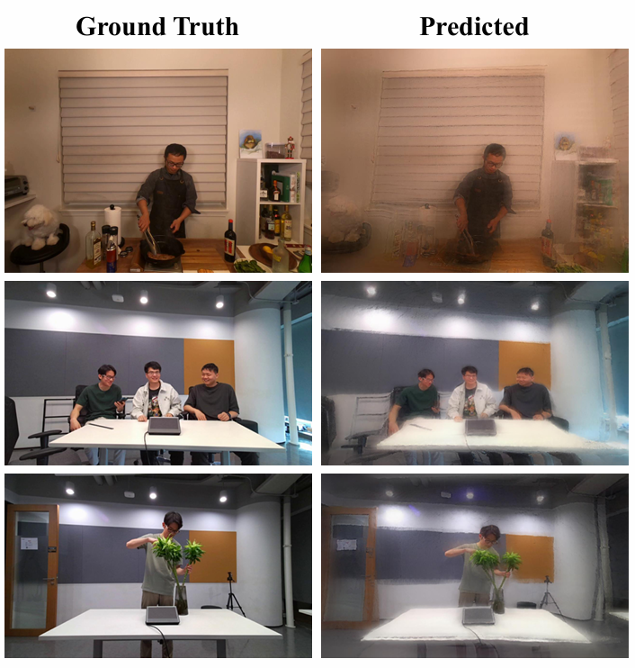

  <h1 align="center">LiveStre4m: Feed-Forward Live Streaming of Novel Views from Unposed Multi-View Video</h1>
  
 <strong>3DMV@CVPRW 2026</strong>

  <h3 align="center"><a href="https://arxiv.org/abs/2604.06740">Paper</a> | <a href="#">Project Page</a>
  

  

<i>Figure 1. Illustration of the proposed LiveStre4m method, a feed-forward model for live-streaming novel viewpoint video from two or more low-resolution input streams.</i>

## Introduction

LiveStre4m is a feed-forward model for real-time novel view synthesis (NVS) that enables live streaming from as few as two unposed, multi-view inputs by predicting camera parameters directly from RGB video streams. By combining a multi-view vision transformer for 3D scene reconstruction with a diffusion-transformer interpolation module, the system achieves an average reconstruction time of 0.07s per frame at 1024x768 resolution, outperforming optimization-based dynamic scene representation methods in runtime.

  

<i>Figure 2. Qualitative results produced by LiveStre4m, synthesizing the target viewpoint using only two neighboring input views, without requiring optimization or ground-truth camera parameters.</i>

## Environment Setup

# Create environment
conda env create -f environment.yml

conda activate livestre4m

## Data Preparation

*(Placeholder)*

## Usage - Inference
*(Placeholder)*

## Results

### Dynamic Scene Reconstruction 
Quantitative comparison against optimization methods on the Neural3DVideo dataset on a single A100 GPU.

| Category | Method | Runtime (s) ↓ | PSNR ↑ | Camera Free | #Views |
| :--- | :--- | :--- | :--- | :--- | :--- |
| **Video Optimization** | K-planes | 48.00 | 32.17 | ❌ | >19 |
| | 4DGS | 7.80 | 32.70 | ❌ | ≥19 |
| | Spacetime-GS | 48.00 | 33.71 | ❌ | ≥19 |
| **Frame Optimization** | StreamRF | 15.00 | 32.09 | ❌ | >19 |
| | 3DGStream | 16.93 | 32.75 | ❌ | ≥19 |
| | IGS | 2.67 | 33.89 | ❌ | ≥19 |
| **Feed-forward** | **LiveStre4m (Ours)** | **0.14** | 20.64 | ✅ | **2** |

*(Note: MeetRoom results follow a similar trend, where LiveStre4m operates in 0.10s using only 2 views.)*

### Feed-Forward Scene Reconstruction
Comparison of feed-forward, camera-free scene reconstruction methods on a single H100 GPU.

| Dataset | Method | Runtime (s) ↓ | PSNR ↑ | Resolution | Pose Free | #Views |
| :--- | :--- | :--- | :--- | :--- | :--- | :--- |
| **Neural3DVideo** | FLARE | 0.249 | 21.45 | 512x384 | ✅ | 2 |
| | **LiveStre4m (Ours)** | **0.062** | **22.44** | 512x384 | ✅ | 2 |
| | **LiveStre4m (Ours)** | 0.074 | 21.11 | **1024x768** | ✅ | 2 |
| **MeetRoom** | FLARE | 0.243 | 16.65 | 512x384 | ✅ | 2 |
| | **LiveStre4m (Ours)** | **0.062** | **19.32** | 512x384 | ✅ | 2 |
| | **LiveStre4m (Ours)** | 0.074 | 18.65 | **1024x768** | ✅ | 2 |
